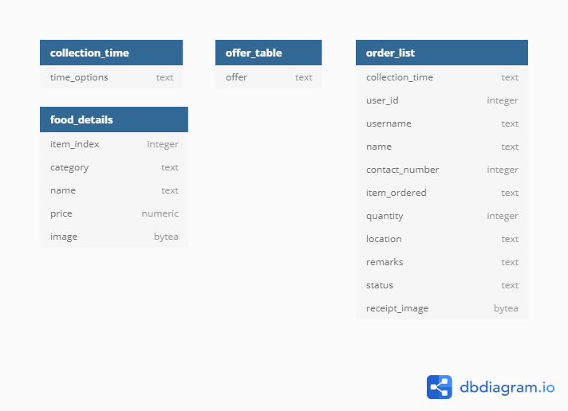

# The Spread Bot
A Telegram Bot for The Spread with order and payment capabilities for customers of The Spread.

[](https://heroku.com/deploy?template=https://github.com/jamestiotio/TheSpreadBot)

## Usage
- `/menu` to check the menu.
- `/order` to place your order.
- `/cart` to check your cart.
- `/offers` to view available deals.
- `/pay` to proceed to payment.
- `/cancel` to cancel your order.
- `/terms` to read our Terms & Conditions.

Several hidden administrative commands with restricted access are also available to provide easy management, servicing and maintenance.

## Setup

**Heroku App Config Vars:**

``` json
{
  "env": {
    "ADMIN_LIST": "[<user-id-1>, <user-id-2>, ...]",
    "BOT_TOKEN": "<id>:<token>",
    "DATABASE_URL": "postgres://<user>:<password>@<server>:<port>/<database>",
    "SUPER_ADMIN": "[<user-id-1>, <user-id-2>, ...]",
    "TZ": "Asia/Singapore",
    "WEBHOOK_URL": "https://<app-name>.herokuapp.com/"
  }
}
```

Finally, issue an HTTPS request to `https://api.telegram.org/bot<id>:<token>/setWebhook?url=https://<app-name>.herokuapp.com/<id>:<token>` to enable the webhook for the bot.

## PostgreSQL Database ER Diagram



- Normal port for PostgreSQL is `5432`.
- Initial data was manually converted from SQLite database to Heroku Postgres using the [ESF Database Migration Toolkit](https://www.dbsofts.com/) with the corresponding temporary database credentials provided by Heroku.

## TODO

- Neaten the source code file structure (separate functions by purpose/type as different modules).

## Additional Resources

- More about The Spread: https://www.facebook.com/thespread.sg/
